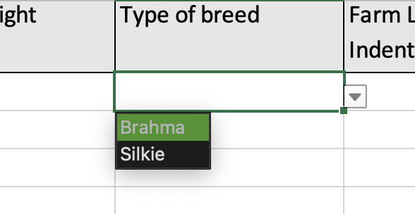

# data entry Excel and OCA schema bundle

**data entry Excel** is a dynamic spreadsheet desgined for efficient data collection while adhering to predefined attributes outlined in an OCA schema.

A schema provides a structured framework that informs users on effectively utilizing data. It includes essential details such as data types, units of measurement, and concise descriptions for each data element (label). To delve deeper into the concept of a schema, refer to the OCA Schema bundle documentation [here](https://oca.colossi.network/specification/#bundle).

## Maximizing the utiliy of data entry Excel

Creating a schema is just the beginning; its actual value lies in its practical application. Rather than languishing in a repository, a schema is meant to be utilized by others, serving as a reliable reference point during their data collection endeavors. Generating a data entry spreadsheet that adheres to the schema description opens avenues for seamless replication of data collection processes.

Utilizing a data entry xls facilitates data collection based on established schemas others employ. This ensures compliance and streamlines the referencing of existing work, simplifying the overall data-collection process.

Learn more about how to create a schema and generating a [data entry Excel](https://agrifooddatacanada.github.io/OCA_training_pathway/).

## Exploring the Features of data entry Excel

> The data entry Excel comprises three separate sheets, each serving a vital role:

- `schema description`: This sheet offers a comprehensive overview of the overlays within an OCA schema bundle. Certain overlyas have been renamed to enhance ease of understanding within the data entry Excel. For instance, **Sensitive** attributes in the data entry Excel correspond to **flagged attributes** in the OCA schema bundle, while **Required** aligns with **conformance**.

Moreover, for attributes requiring data input from specified options, a **look up table** is provided. These options, known as [entry codes](https://oca.colossi.network/specification/#entry-code-overlay) in OCA, are presented in a user-friendly format for quick reference. [Learn more about look up table in data entry](https://www.youtube.com/watch?v=T-Uzr3p41SM&t=180s).

- `data entry`: This is the primary workspace for inputting collected data. Attributes with entry codes are conveniently presented as dropdown list, facilitating accurate and efficient data entry.

- `schema conformant`: Designed to ensure data integrity, this sheet verifies that data entered in the **data entry** sheet adheres to the attributes definitions outlined in the schema bundle.

**N.B** Although there is some sort of validation that occurs in data entry Excel, the complete data validation is done with another tool. Currently, this tool is implemented in `python`, and can be found [here](https://pypi.org/project/oca-ds-validator/0.0.2/).

> Collectively, these three sheets provide a comprehensive framework for structured data entry, simplifying the process while maintaing adherence to schema specifications.

## data entry Excel implementation

The code provided in [dataEnty](./dataEntry.js) has been seamlessly integrated into the codebase of the Semantic Engine, accessible at [semanticengine.org](https://www.semanticengine.org/). This integration enables users to effortlessly generate data entry Excel sheets by either uploading a preexisting OCA bundle, such as the example provided in [chicken_example.json](./chicken_example.json), or by crafting one from scratch.

To explore creating an OCA bundle schema using a schema writer, delve into our detailed guide [here](https://www.semanticengine.org/start). With this robust implementation, the Semantic Engine empowers users to harness the capabilities of data entry Excel efficiently, facilitating streamlined data collection processes tailored to their specific needs.